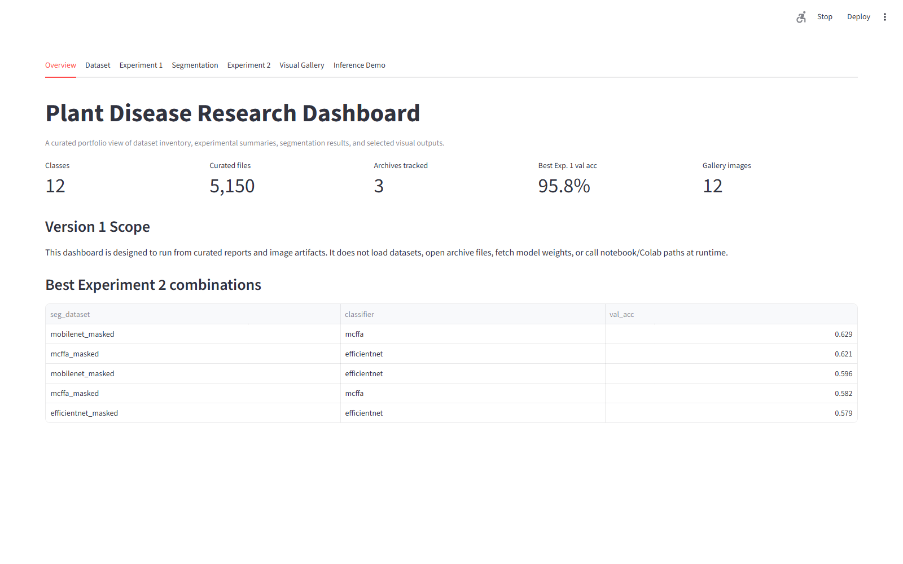
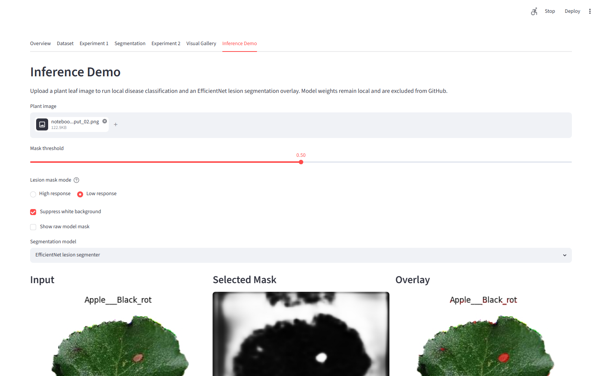

# Plant Disease Segmentation and Classification

This project explores plant disease classification under three image-preparation settings:

- Original leaf images.
- Leaf-segmented images with the background removed.
- Lesion-only masked images that isolate diseased regions.

Version 1 of this repository is a portfolio-ready results dashboard. It summarizes prepared experiments and curated visuals. The Streamlit app also includes an optional local inference tab for classification plus lesion mask overlay when the required model weights are present on your machine.

## Screenshots





## Repository Contents

- `app/streamlit_app.py` - Streamlit dashboard for browsing experiment summaries, segmentation results, dataset inventory metadata, and curated figures.
- `reports/` - Small CSV summaries used by the dashboard.
- `assets/` - Lightweight figure exports and gallery metadata for dashboard display.
- `data/README.md` - Notes about expected local dataset archives and why large data is excluded.
- `src/inference/` - Optional local inference helpers for classification and lesion mask overlay.
- `docs/`, `scripts/`, `src/`, and `tests/` - Reproducibility notes, preparation utilities, reusable helpers, and project checks.

## Not Committed

Large research artifacts are intentionally excluded from the GitHub repository:

- Full datasets and extracted dataset folders.
- Zip archives such as `dataset2.zip`, `seg_dataset2.zip`, and `ground truth.zip`.
- Trained model weights.
- Large generated outputs from experiments or notebooks.

The dashboard uses curated summaries and lightweight figures so it can run after preparation without the original archives, extracted folders, or model weights. The optional inference tab only runs when local weights are available and remains separate from the committed portfolio artifacts.

## Run The Dashboard

Install the lightweight app dependencies:

```bash
pip install -r requirements.txt
```

Start the Streamlit dashboard:

```bash
streamlit run app/streamlit_app.py
```

## Optional Local Inference

The inference tab expects these local, uncommitted weight files:

- `baseline_models-20260620T213513Z-3-001/baseline_models/best_efficientnet_baseline.pth` for EfficientNet-B0 disease classification.
- `efficientnet_best.pt` for EfficientNet lesion segmentation.
- `mobilenet_best.pt` for MobileNet lesion segmentation.
- `mcffa_best.pt` for MCFFA lesion segmentation.

Only segmentation models with local weight files are shown in the app. All weight files are ignored by `.gitignore`.

## Future Work

Future versions can add GPU/device selection, improve calibration reporting, and provide a hosted demo with explicitly managed model artifacts.
